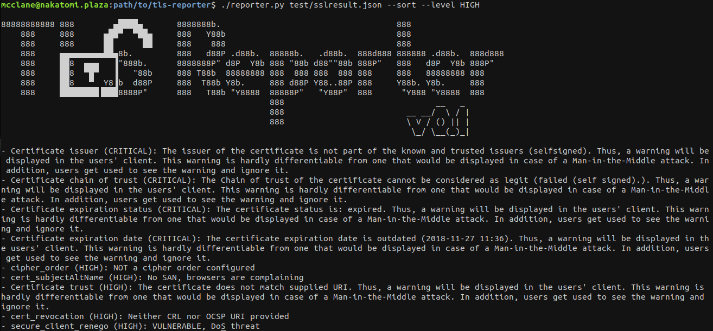

# TLS Reporter

## Purpose

This simple script is designed to help clarifying and reporting results of a [testssl.sh](ihttps://github.com/drwetter/testssl.sh) scan.  
This script is meant to generate a vulnerability description that can be copied and pasted to an audit report.

Simply use the `--jsonfile` option when running testssl and put the created file as a program argument.



## Features

Here is a summary of features implemented for the moment:

### Sort

The `--sort` option can be used to sort vulnerabilities by severity in descending order.

### Minimal Level

The `--level` option allows to specify a minimal severity under which there are ignored.
Minimal severities can also be defined by element by editing the `definitions.json` file and replacing the default `"OK"` by a higher severity level.

## Files

### reporter.py

Main python3 script file.

### definitions.json

Json file containing vulnerabilities desctiptions. This file can and SHOULD be modified by you so that it matches your report quality standards and the level of detail you want to give.  
Some examples are already redacted.  
Each `id` in the testssl output should have its twin `id` in this file.

Formating can be used for `detail`:

* Example extract of the `definitions.json` file:
```json
{
	"id"           : "service",
	"severity"     : "OK",
	"detail"       : "Tests have been performed on the following target: %(ip)s on the port %(port)s.\n%(finding)s."
}
```

* Example extract of the JSON testssl output:
```json
{
        "id"           : "service",
        "ip"           : "localhost/127.0.0.1",
        "port"         : "8443",
        "severity"     : "INFO",
        "finding"      : "Service detected: HTTP"
}
```

* Final output:

```
Tests have been performed on the following target: localhost/127.0.0.1 on the port 8443.
Service detected: HTTP.
```

## Usage

```
usage: reporter.py [-h] [--sort]
                   [--level {OK,INFO,WARN,LOW,MEDIUM,HIGH,CRITICAL}]
                   [infile] [outfile]

A simple testssl result parser for report redactors. Use the --jsonfile option
when running testssl.sh and put the created file as a program argument.

positional arguments:
  infile                The JSON testssl output
  outfile               write the output to outfile

optional arguments:
  -h, --help            show this help message and exit
  --sort                sort the output by severity
  --level {OK,INFO,WARN,LOW,MEDIUM,HIGH,CRITICAL}
                        Set a minimal reported severity
```
